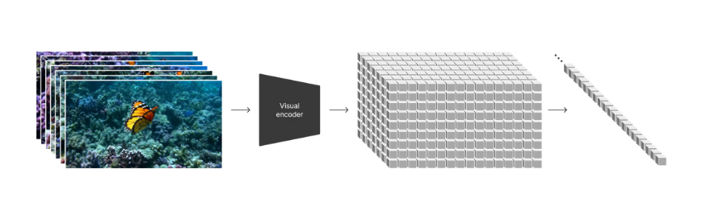

# 看[sora论文](https://openai.com/research/video-generation-models-as-world-simulators)

GPT3(Generative Pre-trained Transformer 3)和GPT3.5使用了LLM(large language Model)模型使用的是将提示词 (prompt)转化为提示词(token)的技术

 而Sora是一个扩散模型(diffusion model)使用了LLM的视觉补丁(visual patches)的技术，

如图所示，将画面一帧帧的使用 视频解码器（visual encoder）解码成一个个的visual patches。

# 整体架构

Transformer->LLM->GPT3/GPT3.5->Token

​			    |    ->Sora	       ->visual patches

Sora->DALLE·3->GPT

视频->图像->文字

由文字提供prompt给DALLE·3提供单幅图像，最后再将单幅图像提供给Sora模型生成视频

# Sora功能

1. 文字生成视频
2. 视频生成视频->续写视频或者前提视频
3. 连接两个视频
4. 通过文字生成图片
5. 使图片3D化
6. 改变视频的焦点?（object state）